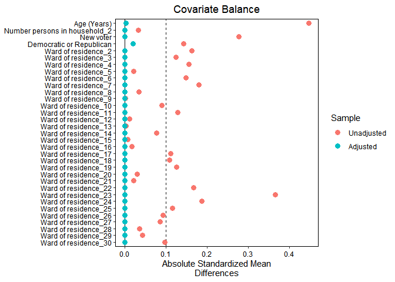

Replication (Imai, 2005). + проверка на ненаблюдаемые конфаундеры
================
Почукаев Даниил, Сосновская Яна, Морева Юлия
23 04 2022

Работа выполнена в учебных целях

## Задача

Мы реплицируем работу Косукэ Имаи с некоторыми своими дополнениями.
(Imai, K. (2005). Do get-out-the-vote calls reduce turnout? The
importance of statistical methods for field experiments. American
Political Science Review, 99(2), 283-300.)

Ссылка на оригинальную работу:
<https://imai.fas.harvard.edu/research/files/matching.pdf> Данные для
анализа (GerberGreenImai) есть в пакете “Matching”
(“JasjeetSekhon/Matching”) Ссылка на пакет:
<https://github.com/JasjeetSekhon/Matching>

В работе Имаи критикует выводы, сделанные Гербером и Грином относительно
эффекта телефонных звонков избирателям для их явки на выборы. Работа
Гербера и Грина (Gerber, A. S., & Green, D. P. (2000). The effects of
canvassing, telephone calls, and direct mail on voter turnout: A field
experiment. American political science review, 94(3), 653-663.)

Мэтчинг - обработка данных с целью подобрать в них пары так, чтобы
получить контрольную группу и группу воздействия с идентичными
наблюдениями по всем ковариатам кроме интересующего нас воздействия. В
данном кейсе мы хотим, вслед за Имаи, посмотреть есть ли
причинно-следственная связь между звонками избирателям и их явкой на
выборы.

В конце работы мы проведем проверку мэтчинга посредством двух методов:
плацебо-тесты и анализ чувствительности. ### Описание данных:

интересующие нас переменные:

-   PERSONS = Количество человек в домохозяйстве

-   WARD = Район проживания

-   AGE = Возраст респондента

-   MAJORPTY = Демократ или республиканец

-   VOTED98 = Голосовал в 1998 году

-   PHN.C1 = Контакт произошел в phntrt1

-   NEW = Новый избиратель

``` r
pkgs_github <- "Matching"

if (length(setdiff(pkgs_github, rownames(installed.packages()))) > 0) {
  devtools::install_github("JasjeetSekhon/Matching")
}
library(MatchIt)
library(sjPlot)
library(ggplot2)
library(cobalt)
library(dplyr)
library(rbounds)
library(rgenoud)
library(optmatch)
library(sjPlot)
library(cobalt)
library(devtools)
#devtools::install_github("Ngendahimana/SensitivityR5")
library(SensitivityR5)
```

## Данные:

``` r
data(GerberGreenImai)
head(GerberGreenImai)
```

    ##      PERSONS WARD QUESTION MAILGRP PHONEGRP PERSNGRP APPEAL CONTACT MAILINGS
    ## 1221       2   13        0       0        1        0      3       0        0
    ## 1228       2   24        1       0        1        0      3       0        0
    ## 1236       2   29        1       0        1        0      2       0        0
    ## 1242       2   10        1       0        1        0      2       0        0
    ## 1279       2   21        0       0        1        0      2       0        0
    ## 1289       2   20        1       0        1        0      3       0        0
    ##      AGE MAJORPTY VOTE96.0 VOTE96.1 MAILCALL VOTED98 PHNSCRPT DIS.MC DIS.PHN
    ## 1221  74        1        0        1        0       1        6     99       1
    ## 1228  37        0        0        1        0       0        6     99       1
    ## 1236  24        1        0        1        0       1        2     99       1
    ## 1242  81        1        0        1        0       1        2     99       1
    ## 1279  34        1        0        0        0       0        2     99       1
    ## 1289  54        1        1        0        0       1        6     99       1
    ##      PHN.C PHNTRT1 PHNTRT2 PHN.C1 PHN.C2 NEW phone  AGE2
    ## 1221     1       1       1      1      1   0     1 54.76
    ## 1228     1       1       1      1      1   0     1 13.69
    ## 1236     1       1       1      1      1   0     1  5.76
    ## 1242     1       1       1      1      1   0     1 65.61
    ## 1279     1       1       1      1      1   1     1 11.56
    ## 1289     1       1       1      1      1   0     1 29.16

``` r
str(GerberGreenImai)
```

    ## 'data.frame':    10829 obs. of  26 variables:
    ##  $ PERSONS : int  2 2 2 2 2 2 2 2 2 2 ...
    ##  $ WARD    : Factor w/ 29 levels "2","3","4","5",..: 12 23 28 9 20 19 17 26 3 16 ...
    ##  $ QUESTION: int  0 1 1 1 0 1 1 0 1 1 ...
    ##  $ MAILGRP : int  0 0 0 0 0 0 0 0 0 0 ...
    ##  $ PHONEGRP: int  1 1 1 1 1 1 1 1 1 1 ...
    ##  $ PERSNGRP: int  0 0 0 0 0 0 0 0 0 0 ...
    ##  $ APPEAL  : int  3 3 2 2 2 3 3 2 2 2 ...
    ##  $ CONTACT : int  0 0 0 0 0 0 0 0 0 0 ...
    ##  $ MAILINGS: int  0 0 0 0 0 0 0 0 0 0 ...
    ##  $ AGE     : int  74 37 24 81 34 54 65 43 52 44 ...
    ##  $ MAJORPTY: int  1 0 1 1 1 1 1 0 1 1 ...
    ##  $ VOTE96.0: int  0 0 0 0 0 1 0 1 0 0 ...
    ##  $ VOTE96.1: int  1 1 1 1 0 0 1 0 1 1 ...
    ##  $ MAILCALL: int  0 0 0 0 0 0 0 0 0 0 ...
    ##  $ VOTED98 : int  1 0 1 1 0 1 1 1 1 1 ...
    ##  $ PHNSCRPT: int  6 6 2 2 2 6 6 2 2 2 ...
    ##  $ DIS.MC  : int  99 99 99 99 99 99 99 99 99 99 ...
    ##  $ DIS.PHN : int  1 1 1 1 1 1 1 1 1 1 ...
    ##  $ PHN.C   : int  1 1 1 1 1 1 1 1 1 1 ...
    ##  $ PHNTRT1 : int  1 1 1 1 1 1 1 1 1 1 ...
    ##  $ PHNTRT2 : int  1 1 1 1 1 1 1 1 1 1 ...
    ##  $ PHN.C1  : int  1 1 1 1 1 1 1 1 1 1 ...
    ##  $ PHN.C2  : int  1 1 1 1 1 1 1 1 1 1 ...
    ##  $ NEW     : num  0 0 0 0 1 0 0 0 0 0 ...
    ##  $ phone   : num  1 1 1 1 1 1 1 1 1 1 ...
    ##  $ AGE2    : num  54.76 13.69 5.76 65.61 11.56 ...

Работа с данными:

``` r
attach(GerberGreenImai)
VOTE96.1 = as.factor(VOTE96.1)
PHN.C1 = as.factor(PHN.C1)
NEW = as.factor(NEW)
VOTED98 = as.factor(VOTED98)
MAJORPTY = as.factor(MAJORPTY)

# для генетического мэтчинга через пакт Matching
Y <- GerberGreenImai$VOTED98 
Tr <- GerberGreenImai$PHN.C1 
X <- cbind(AGE, PERSONS, VOTE96.1, NEW, MAJORPTY,  
           WARD) 
new.names <- c(AGE = "Age (Years)", 
               PERSONS = "Number persons in household", 
               " VOTE96.1" = "Voted in 1996", 
               "NEW" = "New voter", 
               "WARD" = "Ward of residence", 
               "MAJORPTY" = "Democratic or Republican" ) 
detach(GerberGreenImai)
```

## Мэтчинг

Мэтчинг (Метод “ближайшего соседа”)

``` r
#  по мере склонности 
m.skl <- matchit(PHN.C1 ~ AGE  + PERSONS  + VOTE96.1 + NEW +  MAJORPTY + WARD,  
                   data = GerberGreenImai, method = "nearest") 
#  по Махаланобису

m.mln <- matchit (PHN.C1 ~ AGE  + PERSONS  + VOTE96.1 + NEW +  MAJORPTY +  WARD,  
                     data = GerberGreenImai, distance = "mahalanobis") 
# Оптимальный полный мэтчинг 

m.full  <- matchit(PHN.C1 ~ AGE  + PERSONS  + VOTE96.1 + NEW +  MAJORPTY + WARD, 
data = GerberGreenImai, 
method = "full") 

## Подбор соответствий по стратам (CEM)
m.cem <- matchit( PHN.C1 ~ AGE  + PERSONS  + VOTE96.1 + NEW +  MAJORPTY +  WARD, 
data = GerberGreenImai, 
method = "cem")

# генетический мэтчинг 
m.gen = matchit( PHN.C1 ~ AGE  + PERSONS  + VOTE96.1 + NEW +  MAJORPTY +  WARD,
                 data = GerberGreenImai,  
                         method = "genetic",  
                         data.type.int=TRUE,  
                         print = 0, pop.size = 100) 
```

### Проверка: какой мэтчинг подошел лучше

``` r
bal.plot(PHN.C1 ~ AGE  + PERSONS  + VOTE96.1 + NEW + MAJORPTY + WARD,  
        data = GerberGreenImai,  
        weights = data.frame(PScore = get.w(m.skl), 
                             Mahal = get.w(m.mln), 
                             CEM = get.w(m.cem), 
                             FUL = get.w(m.full),
                             GEN = get.w(m.gen)),
        method = c("matching", "matching","matching","matching","matching"),  
        binary = "std", 
        disp.v.ratio = TRUE, 
        disp.ks = TRUE) 
```

    ## No 'var.name' was provided. Displaying balance for AGE.

<!-- -->

``` r
bal.plot(PHN.C1 ~ AGE  + PERSONS  + VOTE96.1 + NEW + MAJORPTY + WARD, "WARD",
         data = GerberGreenImai,  
         weights = data.frame(PScore = get.w(m.skl), 
                             Mahal = get.w(m.mln), 
                             CEM = get.w(m.cem), 
                             FUL = get.w(m.full),
                             GEN = get.w(m.gen)),
         method = c("matching", "matching","matching","matching","matching"),  
         binary = "std", 
         disp.v.ratio = TRUE, 
         disp.ks = TRUE)+ coord_flip() +labs(, y='')
```

<!-- -->

``` r
bal.plot(PHN.C1 ~ AGE  + PERSONS  + VOTE96.1 + NEW + MAJORPTY + WARD, "PERSONS",
         data = GerberGreenImai,  
         weights = data.frame(PScore = get.w(m.skl), 
                             Mahal = get.w(m.mln), 
                             CEM = get.w(m.cem), 
                             FUL = get.w(m.full),
                             GEN = get.w(m.gen)),
         method = c("matching", "matching","matching","matching","matching"),  
         binary = "std", 
         disp.v.ratio = TRUE, 
         disp.ks = TRUE)+labs(, y='')
```

<!-- -->

``` r
bal.plot(PHN.C1 ~ AGE  + PERSONS  + VOTE96.1 + NEW + MAJORPTY + WARD, "VOTE96.1",
         data = GerberGreenImai,  
         weights = data.frame(PScore = get.w(m.skl), 
                             Mahal = get.w(m.mln), 
                             CEM = get.w(m.cem), 
                             FUL = get.w(m.full),
                             GEN = get.w(m.gen)),
         method = c("matching", "matching","matching","matching","matching"),  
         binary = "std", 
         disp.v.ratio = TRUE, 
         disp.ks = TRUE) +labs(, y='')
```

<!-- -->

``` r
bal.plot(PHN.C1 ~ AGE  + PERSONS  + VOTE96.1 + NEW + MAJORPTY + WARD, "NEW",
         data = GerberGreenImai,  
         weights = data.frame(PScore = get.w(m.skl), 
                             Mahal = get.w(m.mln), 
                             CEM = get.w(m.cem), 
                             FUL = get.w(m.full),
                             GEN = get.w(m.gen)),
         method = c("matching", "matching","matching","matching","matching"),  
         binary = "std", 
         disp.v.ratio = TRUE, 
         disp.ks = TRUE)+labs(, y='')
```

<!-- -->

``` r
bal.plot(PHN.C1 ~ AGE  + PERSONS  + VOTE96.1 + NEW + MAJORPTY + WARD, "MAJORPTY",
         data = GerberGreenImai,  
         weights = data.frame(PScore = get.w(m.skl), 
                             Mahal = get.w(m.mln), 
                             CEM = get.w(m.cem), 
                             FUL = get.w(m.full),
                             GEN = get.w(m.gen)),
         method = c("matching", "matching","matching","matching","matching"),  
         binary = "std", 
         disp.v.ratio = TRUE, 
         disp.ks = TRUE)+labs(, y='')
```

<!-- -->

``` r
love.plot(PHN.C1 ~ AGE  + PERSONS  + VOTE96.1 + NEW +  MAJORPTY ,  
          data = GerberGreenImai,  
          stats = "ks.statistics", 
          weights = data.frame(PScore = get.w(m.skl), 
                             Mahal = get.w(m.mln), 
                             CEM = get.w(m.cem), 
                             FUL = get.w(m.full),
                             GEN = get.w(m.gen)),
          method = c("matching", "matching", "matching","matching","matching"),
          line = TRUE, binary = "std",threshold = .1,    
          #var.names = new.names, 
          shapes = c("circle", "square", "triangle", "diamond")) +  
  scale_colour_hue()+ 
  theme(legend.position = c(.85, .25), 
        legend.box.background = element_rect(),  
        legend.box.margin = margin(1, 1, 1, 1))
```

<!-- -->

Отдельно мы решили посмотреть на переменную WARD, тк в ней очень много
факторов

``` r
love.plot(PHN.C1 ~ WARD,  
          data = GerberGreenImai,  
          stats = "ks.statistics", 
          weights = data.frame(PScore = get.w(m.skl), 
                             Mahal = get.w(m.mln), 
                             CEM = get.w(m.cem), 
                             FUL = get.w(m.full),
                             GEN = get.w(m.gen)),
          method = c("matching", "matching", "matching","matching","matching"),
          line = TRUE, binary = "std",threshold = .1,    
          #var.names = new.names, 
          shapes = c("circle", "square", "triangle", "diamond")) +  
  scale_colour_hue()+ 
  theme(legend.position = c(.85, .25), 
        legend.box.background = element_rect(),  
        legend.box.margin = margin(1, 1, 1, 1))
```

<!-- -->

По результам сравнения разных видом мэтчинга видно, что наилучшими
являются генетический, по стратам (cem) и чуть в меньшей степени - по
Махаланобису (но в пределах допустимого)

## Оценка значимости эффекта

Посмотрим как для отмеченных выше мэтчингов выглядит эффект звонков для
явки людей на выборы

``` r
model_g = glm(VOTED98 ~ PHN.C1, family = "binomial", match.data(m.gen))
model_g.full = glm(VOTED98 ~ PHN.C1 + AGE + VOTE96.1 + NEW + PERSONS + MAJORPTY + WARD, family = "binomial", match.data(m.gen))

model_c = glm(VOTED98 ~ PHN.C1, family = "binomial", match.data(m.cem))
model_c.full = glm(VOTED98 ~ PHN.C1 + AGE  + VOTE96.1 + NEW + PERSONS + MAJORPTY + WARD, family = "binomial", match.data(m.cem))

model_m = glm(VOTED98 ~ PHN.C1, family = "binomial", match.data(m.mln))
model_m.full = glm(VOTED98 ~ PHN.C1 + AGE  + VOTE96.1 + NEW + PERSONS + MAJORPTY + WARD, family = "binomial", match.data(m.mln))


tab_model(model_g, model_g.full,  model_c, model_c.full, model_m, model_m.full,  collapse.ci = TRUE, terms = c("PHN.C1","AGE", "NEW","PERSONS", "VOTE96.1", "MAJORPTY"),  
          dv.labels = c("Genetic", "Genetic full", "CEM", "CEM full", "Mahalanobis", "Mahalanobis full"))
```

<table style="border-collapse:collapse; border:none;">
<tr>
<th style="border-top: double; text-align:center; font-style:normal; font-weight:bold; padding:0.2cm;  text-align:left; ">
 
</th>
<th colspan="2" style="border-top: double; text-align:center; font-style:normal; font-weight:bold; padding:0.2cm; ">
Genetic
</th>
<th colspan="2" style="border-top: double; text-align:center; font-style:normal; font-weight:bold; padding:0.2cm; ">
Genetic full
</th>
<th colspan="2" style="border-top: double; text-align:center; font-style:normal; font-weight:bold; padding:0.2cm; ">
CEM
</th>
<th colspan="2" style="border-top: double; text-align:center; font-style:normal; font-weight:bold; padding:0.2cm; ">
CEM full
</th>
<th colspan="2" style="border-top: double; text-align:center; font-style:normal; font-weight:bold; padding:0.2cm; ">
Mahalanobis
</th>
<th colspan="2" style="border-top: double; text-align:center; font-style:normal; font-weight:bold; padding:0.2cm; ">
Mahalanobis full
</th>
</tr>
<tr>
<td style=" text-align:center; border-bottom:1px solid; font-style:italic; font-weight:normal;  text-align:left; ">
Predictors
</td>
<td style=" text-align:center; border-bottom:1px solid; font-style:italic; font-weight:normal;  ">
Odds Ratios
</td>
<td style=" text-align:center; border-bottom:1px solid; font-style:italic; font-weight:normal;  ">
p
</td>
<td style=" text-align:center; border-bottom:1px solid; font-style:italic; font-weight:normal;  ">
Odds Ratios
</td>
<td style=" text-align:center; border-bottom:1px solid; font-style:italic; font-weight:normal;  ">
p
</td>
<td style=" text-align:center; border-bottom:1px solid; font-style:italic; font-weight:normal;  ">
Odds Ratios
</td>
<td style=" text-align:center; border-bottom:1px solid; font-style:italic; font-weight:normal;  col7">
p
</td>
<td style=" text-align:center; border-bottom:1px solid; font-style:italic; font-weight:normal;  col8">
Odds Ratios
</td>
<td style=" text-align:center; border-bottom:1px solid; font-style:italic; font-weight:normal;  col9">
p
</td>
<td style=" text-align:center; border-bottom:1px solid; font-style:italic; font-weight:normal;  0">
Odds Ratios
</td>
<td style=" text-align:center; border-bottom:1px solid; font-style:italic; font-weight:normal;  1">
p
</td>
<td style=" text-align:center; border-bottom:1px solid; font-style:italic; font-weight:normal;  2">
Odds Ratios
</td>
<td style=" text-align:center; border-bottom:1px solid; font-style:italic; font-weight:normal;  3">
p
</td>
</tr>
<tr>
<td style=" padding:0.2cm; text-align:left; vertical-align:top; text-align:left; ">
PHN C1
</td>
<td style=" padding:0.2cm; text-align:left; vertical-align:top; text-align:center;  ">
1.27<br>(0.88 – 1.83)
</td>
<td style=" padding:0.2cm; text-align:left; vertical-align:top; text-align:center;  ">
0.195
</td>
<td style=" padding:0.2cm; text-align:left; vertical-align:top; text-align:center;  ">
1.45<br>(0.92 – 2.29)
</td>
<td style=" padding:0.2cm; text-align:left; vertical-align:top; text-align:center;  ">
0.109
</td>
<td style=" padding:0.2cm; text-align:left; vertical-align:top; text-align:center;  ">
1.01<br>(0.75 – 1.36)
</td>
<td style=" padding:0.2cm; text-align:left; vertical-align:top; text-align:center;  col7">
0.968
</td>
<td style=" padding:0.2cm; text-align:left; vertical-align:top; text-align:center;  col8">
1.49<br>(1.02 – 2.21)
</td>
<td style=" padding:0.2cm; text-align:left; vertical-align:top; text-align:center;  col9">
<strong>0.043</strong>
</td>
<td style=" padding:0.2cm; text-align:left; vertical-align:top; text-align:center;  0">
1.29<br>(0.90 – 1.86)
</td>
<td style=" padding:0.2cm; text-align:left; vertical-align:top; text-align:center;  1">
0.165
</td>
<td style=" padding:0.2cm; text-align:left; vertical-align:top; text-align:center;  2">
1.48<br>(0.95 – 2.34)
</td>
<td style=" padding:0.2cm; text-align:left; vertical-align:top; text-align:center;  3">
0.088
</td>
</tr>
<tr>
<td style=" padding:0.2cm; text-align:left; vertical-align:top; text-align:left; ">
AGE
</td>
<td style=" padding:0.2cm; text-align:left; vertical-align:top; text-align:center;  ">
</td>
<td style=" padding:0.2cm; text-align:left; vertical-align:top; text-align:center;  ">
</td>
<td style=" padding:0.2cm; text-align:left; vertical-align:top; text-align:center;  ">
1.02<br>(1.01 – 1.04)
</td>
<td style=" padding:0.2cm; text-align:left; vertical-align:top; text-align:center;  ">
<strong>0.002</strong>
</td>
<td style=" padding:0.2cm; text-align:left; vertical-align:top; text-align:center;  ">
</td>
<td style=" padding:0.2cm; text-align:left; vertical-align:top; text-align:center;  col7">
</td>
<td style=" padding:0.2cm; text-align:left; vertical-align:top; text-align:center;  col8">
1.02<br>(1.01 – 1.03)
</td>
<td style=" padding:0.2cm; text-align:left; vertical-align:top; text-align:center;  col9">
<strong>0.001</strong>
</td>
<td style=" padding:0.2cm; text-align:left; vertical-align:top; text-align:center;  0">
</td>
<td style=" padding:0.2cm; text-align:left; vertical-align:top; text-align:center;  1">
</td>
<td style=" padding:0.2cm; text-align:left; vertical-align:top; text-align:center;  2">
1.02<br>(1.01 – 1.04)
</td>
<td style=" padding:0.2cm; text-align:left; vertical-align:top; text-align:center;  3">
<strong>0.001</strong>
</td>
</tr>
<tr>
<td style=" padding:0.2cm; text-align:left; vertical-align:top; text-align:left; ">
VOTE96 1
</td>
<td style=" padding:0.2cm; text-align:left; vertical-align:top; text-align:center;  ">
</td>
<td style=" padding:0.2cm; text-align:left; vertical-align:top; text-align:center;  ">
</td>
<td style=" padding:0.2cm; text-align:left; vertical-align:top; text-align:center;  ">
25.01<br>(11.81 – 57.87)
</td>
<td style=" padding:0.2cm; text-align:left; vertical-align:top; text-align:center;  ">
<strong>\<0.001</strong>
</td>
<td style=" padding:0.2cm; text-align:left; vertical-align:top; text-align:center;  ">
</td>
<td style=" padding:0.2cm; text-align:left; vertical-align:top; text-align:center;  col7">
</td>
<td style=" padding:0.2cm; text-align:left; vertical-align:top; text-align:center;  col8">
56.07<br>(29.73 – 114.08)
</td>
<td style=" padding:0.2cm; text-align:left; vertical-align:top; text-align:center;  col9">
<strong>\<0.001</strong>
</td>
<td style=" padding:0.2cm; text-align:left; vertical-align:top; text-align:center;  0">
</td>
<td style=" padding:0.2cm; text-align:left; vertical-align:top; text-align:center;  1">
</td>
<td style=" padding:0.2cm; text-align:left; vertical-align:top; text-align:center;  2">
20.60<br>(9.93 – 46.25)
</td>
<td style=" padding:0.2cm; text-align:left; vertical-align:top; text-align:center;  3">
<strong>\<0.001</strong>
</td>
</tr>
<tr>
<td style=" padding:0.2cm; text-align:left; vertical-align:top; text-align:left; ">
NEW
</td>
<td style=" padding:0.2cm; text-align:left; vertical-align:top; text-align:center;  ">
</td>
<td style=" padding:0.2cm; text-align:left; vertical-align:top; text-align:center;  ">
</td>
<td style=" padding:0.2cm; text-align:left; vertical-align:top; text-align:center;  ">
9.25<br>(3.26 – 27.80)
</td>
<td style=" padding:0.2cm; text-align:left; vertical-align:top; text-align:center;  ">
<strong>\<0.001</strong>
</td>
<td style=" padding:0.2cm; text-align:left; vertical-align:top; text-align:center;  ">
</td>
<td style=" padding:0.2cm; text-align:left; vertical-align:top; text-align:center;  col7">
</td>
<td style=" padding:0.2cm; text-align:left; vertical-align:top; text-align:center;  col8">
22.77<br>(9.70 – 55.87)
</td>
<td style=" padding:0.2cm; text-align:left; vertical-align:top; text-align:center;  col9">
<strong>\<0.001</strong>
</td>
<td style=" padding:0.2cm; text-align:left; vertical-align:top; text-align:center;  0">
</td>
<td style=" padding:0.2cm; text-align:left; vertical-align:top; text-align:center;  1">
</td>
<td style=" padding:0.2cm; text-align:left; vertical-align:top; text-align:center;  2">
7.31<br>(2.60 – 21.57)
</td>
<td style=" padding:0.2cm; text-align:left; vertical-align:top; text-align:center;  3">
<strong>\<0.001</strong>
</td>
</tr>
<tr>
<td style=" padding:0.2cm; text-align:left; vertical-align:top; text-align:left; ">
PERSONS
</td>
<td style=" padding:0.2cm; text-align:left; vertical-align:top; text-align:center;  ">
</td>
<td style=" padding:0.2cm; text-align:left; vertical-align:top; text-align:center;  ">
</td>
<td style=" padding:0.2cm; text-align:left; vertical-align:top; text-align:center;  ">
1.59<br>(0.93 – 2.70)
</td>
<td style=" padding:0.2cm; text-align:left; vertical-align:top; text-align:center;  ">
0.087
</td>
<td style=" padding:0.2cm; text-align:left; vertical-align:top; text-align:center;  ">
</td>
<td style=" padding:0.2cm; text-align:left; vertical-align:top; text-align:center;  col7">
</td>
<td style=" padding:0.2cm; text-align:left; vertical-align:top; text-align:center;  col8">
1.49<br>(1.05 – 2.12)
</td>
<td style=" padding:0.2cm; text-align:left; vertical-align:top; text-align:center;  col9">
<strong>0.024</strong>
</td>
<td style=" padding:0.2cm; text-align:left; vertical-align:top; text-align:center;  0">
</td>
<td style=" padding:0.2cm; text-align:left; vertical-align:top; text-align:center;  1">
</td>
<td style=" padding:0.2cm; text-align:left; vertical-align:top; text-align:center;  2">
1.32<br>(0.77 – 2.26)
</td>
<td style=" padding:0.2cm; text-align:left; vertical-align:top; text-align:center;  3">
0.315
</td>
</tr>
<tr>
<td style=" padding:0.2cm; text-align:left; vertical-align:top; text-align:left; ">
MAJORPTY
</td>
<td style=" padding:0.2cm; text-align:left; vertical-align:top; text-align:center;  ">
</td>
<td style=" padding:0.2cm; text-align:left; vertical-align:top; text-align:center;  ">
</td>
<td style=" padding:0.2cm; text-align:left; vertical-align:top; text-align:center;  ">
1.65<br>(0.90 – 3.04)
</td>
<td style=" padding:0.2cm; text-align:left; vertical-align:top; text-align:center;  ">
0.104
</td>
<td style=" padding:0.2cm; text-align:left; vertical-align:top; text-align:center;  ">
</td>
<td style=" padding:0.2cm; text-align:left; vertical-align:top; text-align:center;  col7">
</td>
<td style=" padding:0.2cm; text-align:left; vertical-align:top; text-align:center;  col8">
1.94<br>(1.25 – 3.00)
</td>
<td style=" padding:0.2cm; text-align:left; vertical-align:top; text-align:center;  col9">
<strong>0.003</strong>
</td>
<td style=" padding:0.2cm; text-align:left; vertical-align:top; text-align:center;  0">
</td>
<td style=" padding:0.2cm; text-align:left; vertical-align:top; text-align:center;  1">
</td>
<td style=" padding:0.2cm; text-align:left; vertical-align:top; text-align:center;  2">
2.06<br>(1.13 – 3.79)
</td>
<td style=" padding:0.2cm; text-align:left; vertical-align:top; text-align:center;  3">
<strong>0.019</strong>
</td>
</tr>
<tr>
<td style=" padding:0.2cm; text-align:left; vertical-align:top; text-align:left; padding-top:0.1cm; padding-bottom:0.1cm; border-top:1px solid;">
Observations
</td>
<td style=" padding:0.2cm; text-align:left; vertical-align:top; padding-top:0.1cm; padding-bottom:0.1cm; text-align:left; border-top:1px solid;" colspan="2">
494
</td>
<td style=" padding:0.2cm; text-align:left; vertical-align:top; padding-top:0.1cm; padding-bottom:0.1cm; text-align:left; border-top:1px solid;" colspan="2">
494
</td>
<td style=" padding:0.2cm; text-align:left; vertical-align:top; padding-top:0.1cm; padding-bottom:0.1cm; text-align:left; border-top:1px solid;" colspan="2">
1368
</td>
<td style=" padding:0.2cm; text-align:left; vertical-align:top; padding-top:0.1cm; padding-bottom:0.1cm; text-align:left; border-top:1px solid;" colspan="2">
1368
</td>
<td style=" padding:0.2cm; text-align:left; vertical-align:top; padding-top:0.1cm; padding-bottom:0.1cm; text-align:left; border-top:1px solid;" colspan="2">
494
</td>
<td style=" padding:0.2cm; text-align:left; vertical-align:top; padding-top:0.1cm; padding-bottom:0.1cm; text-align:left; border-top:1px solid;" colspan="2">
494
</td>
</tr>
<tr>
<td style=" padding:0.2cm; text-align:left; vertical-align:top; text-align:left; padding-top:0.1cm; padding-bottom:0.1cm;">
R<sup>2</sup> Tjur
</td>
<td style=" padding:0.2cm; text-align:left; vertical-align:top; padding-top:0.1cm; padding-bottom:0.1cm; text-align:left;" colspan="2">
0.003
</td>
<td style=" padding:0.2cm; text-align:left; vertical-align:top; padding-top:0.1cm; padding-bottom:0.1cm; text-align:left;" colspan="2">
0.352
</td>
<td style=" padding:0.2cm; text-align:left; vertical-align:top; padding-top:0.1cm; padding-bottom:0.1cm; text-align:left;" colspan="2">
0.000
</td>
<td style=" padding:0.2cm; text-align:left; vertical-align:top; padding-top:0.1cm; padding-bottom:0.1cm; text-align:left;" colspan="2">
0.316
</td>
<td style=" padding:0.2cm; text-align:left; vertical-align:top; padding-top:0.1cm; padding-bottom:0.1cm; text-align:left;" colspan="2">
0.004
</td>
<td style=" padding:0.2cm; text-align:left; vertical-align:top; padding-top:0.1cm; padding-bottom:0.1cm; text-align:left;" colspan="2">
0.353
</td>
</tr>
</table>

Мы не стали включать в таблицу переменную WARD, так как в ней очень
много факторов, однако для нас не столь важны, главное, что здесь хотели
посмотреть - это есть ли эффект для переменной звонки (PHN.C1). WARD
тажке была включена как переменная в модель, что видно в коде.

Видно, что без контроля по другим пременным (ковариатам) регрессия не
показывает значимого эффекта звонков для явки на выборы. Это
соответствует тому что, утверждает Имаи, критикуя Гербера и Грина
(Gerber, Green, 2000). При добавлении ковариат в генетическом меэтчинге
и мэтчинге по Махаланобису, также нет эффекта. Однако, при добавлении
ковариат, в мэтчинге с подбором по стратам эффект все же есть, и он
положительный. Но дисперсия достаточно большая (1.02 – 2.21), также
p-value находится близко к пороговому значению в 0.05, что говорит о
том, что возможно эффекта все же нет. Во всяком случае мы не можем
говорить о нем столь уверено. На это возможно повляло то, что в подборе
по стратам временно огрубляет данные в соответствии с идеями
исследователей, а затем находит точные совпадения либо то, что
формируется больше наблюдений.

Таким образом мы склонны согласиться с Имаи, что эффекта нет: телефонные
звонки не приводят к увеличению или уменьшению явки избирателей на
выборы.

## Плацебо-тесты

Цель плацебо-тестов - посмотреть, есть ли эффект там, где его быть не
должно. Если ли эффект есть, значит скорее всего присутсвует
ненаблюдаемая переменная, которую я не могу контрлировать (ее нет в
данных). Тест позволяет выявить, есть ли у предложенного мэтчинга
проблемы

Тк лучше всего эффект дал генетический мэтчинг, плацебо тесты мы решили
делать на нем

Плацебо-тесты желательно делать много раз для того чтобы рассмотреть
множество возможных вариантов

### Замена Y (VOTE98) на голосование в 1996 (VOTE96.1)

``` r
m.genV= matchit(PHN.C1 ~ AGE  +  NEW + MAJORPTY + WARD + PERSONS, data = GerberGreenImai,  
                   method = "genetic",  
                   data.type.int=TRUE,  
                   print = 0, pop.size = 100) 

love.plot(PHN.C1 ~ AGE + PERSONS + NEW + MAJORPTY + WARD, data = GerberGreenImai, abs = T, 
          weights = list(Genetic = get.w(m.genV)), 
          method = rep("matching"),  
          line = FALSE,      
          binary = "std",      
          threshold = 0.1,    
          var.names = new.names, 
          shapes = c("circle", "square", "diamond")) + 
  scale_colour_hue()
```

<!-- -->

``` r
model_v96 <- glm(VOTE96.1 ~ PHN.C1, family = "binomial", match.data(m.genV)) 
model_v96.full <- glm(VOTE96.1 ~ PHN.C1 + AGE  + NEW + PERSONS + MAJORPTY + WARD, family = "binomial", match.data(m.genV)) 
tab_model(model_v96, model_v96.full, collapse.ci = TRUE, terms = c("PHN.C1", "AGE", "NEW", "PERSONS", "MAJORPTY"))
```

<table style="border-collapse:collapse; border:none;">
<tr>
<th style="border-top: double; text-align:center; font-style:normal; font-weight:bold; padding:0.2cm;  text-align:left; ">
 
</th>
<th colspan="2" style="border-top: double; text-align:center; font-style:normal; font-weight:bold; padding:0.2cm; ">
VOTE 96.1
</th>
<th colspan="2" style="border-top: double; text-align:center; font-style:normal; font-weight:bold; padding:0.2cm; ">
VOTE 96.1
</th>
</tr>
<tr>
<td style=" text-align:center; border-bottom:1px solid; font-style:italic; font-weight:normal;  text-align:left; ">
Predictors
</td>
<td style=" text-align:center; border-bottom:1px solid; font-style:italic; font-weight:normal;  ">
Odds Ratios
</td>
<td style=" text-align:center; border-bottom:1px solid; font-style:italic; font-weight:normal;  ">
p
</td>
<td style=" text-align:center; border-bottom:1px solid; font-style:italic; font-weight:normal;  ">
Odds Ratios
</td>
<td style=" text-align:center; border-bottom:1px solid; font-style:italic; font-weight:normal;  ">
p
</td>
</tr>
<tr>
<td style=" padding:0.2cm; text-align:left; vertical-align:top; text-align:left; ">
PHN C1
</td>
<td style=" padding:0.2cm; text-align:left; vertical-align:top; text-align:center;  ">
1.23<br>(0.84 – 1.81)
</td>
<td style=" padding:0.2cm; text-align:left; vertical-align:top; text-align:center;  ">
0.285
</td>
<td style=" padding:0.2cm; text-align:left; vertical-align:top; text-align:center;  ">
1.41<br>(0.86 – 2.31)
</td>
<td style=" padding:0.2cm; text-align:left; vertical-align:top; text-align:center;  ">
0.170
</td>
</tr>
<tr>
<td style=" padding:0.2cm; text-align:left; vertical-align:top; text-align:left; ">
AGE
</td>
<td style=" padding:0.2cm; text-align:left; vertical-align:top; text-align:center;  ">
</td>
<td style=" padding:0.2cm; text-align:left; vertical-align:top; text-align:center;  ">
</td>
<td style=" padding:0.2cm; text-align:left; vertical-align:top; text-align:center;  ">
1.01<br>(0.99 – 1.02)
</td>
<td style=" padding:0.2cm; text-align:left; vertical-align:top; text-align:center;  ">
0.242
</td>
</tr>
<tr>
<td style=" padding:0.2cm; text-align:left; vertical-align:top; text-align:left; ">
NEW
</td>
<td style=" padding:0.2cm; text-align:left; vertical-align:top; text-align:center;  ">
</td>
<td style=" padding:0.2cm; text-align:left; vertical-align:top; text-align:center;  ">
</td>
<td style=" padding:0.2cm; text-align:left; vertical-align:top; text-align:center;  ">
0.00<br>(0.00 – 0.00)
</td>
<td style=" padding:0.2cm; text-align:left; vertical-align:top; text-align:center;  ">
0.982
</td>
</tr>
<tr>
<td style=" padding:0.2cm; text-align:left; vertical-align:top; text-align:left; ">
PERSONS
</td>
<td style=" padding:0.2cm; text-align:left; vertical-align:top; text-align:center;  ">
</td>
<td style=" padding:0.2cm; text-align:left; vertical-align:top; text-align:center;  ">
</td>
<td style=" padding:0.2cm; text-align:left; vertical-align:top; text-align:center;  ">
2.46<br>(1.44 – 4.27)
</td>
<td style=" padding:0.2cm; text-align:left; vertical-align:top; text-align:center;  ">
<strong>0.001</strong>
</td>
</tr>
<tr>
<td style=" padding:0.2cm; text-align:left; vertical-align:top; text-align:left; ">
MAJORPTY
</td>
<td style=" padding:0.2cm; text-align:left; vertical-align:top; text-align:center;  ">
</td>
<td style=" padding:0.2cm; text-align:left; vertical-align:top; text-align:center;  ">
</td>
<td style=" padding:0.2cm; text-align:left; vertical-align:top; text-align:center;  ">
1.69<br>(0.90 – 3.17)
</td>
<td style=" padding:0.2cm; text-align:left; vertical-align:top; text-align:center;  ">
0.101
</td>
</tr>
<tr>
<td style=" padding:0.2cm; text-align:left; vertical-align:top; text-align:left; padding-top:0.1cm; padding-bottom:0.1cm; border-top:1px solid;">
Observations
</td>
<td style=" padding:0.2cm; text-align:left; vertical-align:top; padding-top:0.1cm; padding-bottom:0.1cm; text-align:left; border-top:1px solid;" colspan="2">
494
</td>
<td style=" padding:0.2cm; text-align:left; vertical-align:top; padding-top:0.1cm; padding-bottom:0.1cm; text-align:left; border-top:1px solid;" colspan="2">
494
</td>
</tr>
<tr>
<td style=" padding:0.2cm; text-align:left; vertical-align:top; text-align:left; padding-top:0.1cm; padding-bottom:0.1cm;">
R<sup>2</sup> Tjur
</td>
<td style=" padding:0.2cm; text-align:left; vertical-align:top; padding-top:0.1cm; padding-bottom:0.1cm; text-align:left;" colspan="2">
0.002
</td>
<td style=" padding:0.2cm; text-align:left; vertical-align:top; padding-top:0.1cm; padding-bottom:0.1cm; text-align:left;" colspan="2">
0.387
</td>
</tr>
</table>

Тест показал, что эффекта между зависимой и воздействующей переменной
нет.

### Замена Y (VOTE98) на (PERSONS)

``` r
# Генетический мэтчинг 
m.genP= matchit(PHN.C1 ~ AGE  +  NEW + MAJORPTY + WARD + VOTE96.1, data = GerberGreenImai,  
                         method = "genetic",  
                         data.type.int=TRUE,  
                         print = 0, pop.size = 100) 

love.plot(PHN.C1 ~ AGE + VOTE96.1 + NEW + MAJORPTY + WARD, data = GerberGreenImai, abs = T, 
          weights = list(Genetic = get.w(m.genP)),
          method = rep("matching"),  
          line = FALSE,      
          binary = "std",      
          threshold = 0.1,    
          var.names = new.names, 
          shapes = c("circle", "square", "diamond")) + 
  scale_colour_hue()
```

<!-- -->

``` r
# Оцениваем эффект с помощью логистической регрессии 
model_persons <- glm(as.factor(PERSONS) ~ PHN.C1, family = "binomial", match.data(m.genP)) 

model_persons.full <- glm(as.factor(PERSONS) ~ PHN.C1 + AGE  + NEW + VOTE96.1+ MAJORPTY + WARD, family = "binomial", match.data(m.genP)) 
tab_model(model_persons, model_persons.full, collapse.ci = TRUE, terms = c("PHN.C1","AGE", "NEW", "VOTE96.1", "MAJORPTY"))
```

<table style="border-collapse:collapse; border:none;">
<tr>
<th style="border-top: double; text-align:center; font-style:normal; font-weight:bold; padding:0.2cm;  text-align:left; ">
 
</th>
<th colspan="2" style="border-top: double; text-align:center; font-style:normal; font-weight:bold; padding:0.2cm; ">
as factor(PERSONS)
</th>
<th colspan="2" style="border-top: double; text-align:center; font-style:normal; font-weight:bold; padding:0.2cm; ">
as factor(PERSONS)
</th>
</tr>
<tr>
<td style=" text-align:center; border-bottom:1px solid; font-style:italic; font-weight:normal;  text-align:left; ">
Predictors
</td>
<td style=" text-align:center; border-bottom:1px solid; font-style:italic; font-weight:normal;  ">
Odds Ratios
</td>
<td style=" text-align:center; border-bottom:1px solid; font-style:italic; font-weight:normal;  ">
p
</td>
<td style=" text-align:center; border-bottom:1px solid; font-style:italic; font-weight:normal;  ">
Odds Ratios
</td>
<td style=" text-align:center; border-bottom:1px solid; font-style:italic; font-weight:normal;  ">
p
</td>
</tr>
<tr>
<td style=" padding:0.2cm; text-align:left; vertical-align:top; text-align:left; ">
PHN C1
</td>
<td style=" padding:0.2cm; text-align:left; vertical-align:top; text-align:center;  ">
1.12<br>(0.79 – 1.59)
</td>
<td style=" padding:0.2cm; text-align:left; vertical-align:top; text-align:center;  ">
0.529
</td>
<td style=" padding:0.2cm; text-align:left; vertical-align:top; text-align:center;  ">
1.16<br>(0.77 – 1.75)
</td>
<td style=" padding:0.2cm; text-align:left; vertical-align:top; text-align:center;  ">
0.465
</td>
</tr>
<tr>
<td style=" padding:0.2cm; text-align:left; vertical-align:top; text-align:left; ">
AGE
</td>
<td style=" padding:0.2cm; text-align:left; vertical-align:top; text-align:center;  ">
</td>
<td style=" padding:0.2cm; text-align:left; vertical-align:top; text-align:center;  ">
</td>
<td style=" padding:0.2cm; text-align:left; vertical-align:top; text-align:center;  ">
0.99<br>(0.98 – 1.00)
</td>
<td style=" padding:0.2cm; text-align:left; vertical-align:top; text-align:center;  ">
0.050
</td>
</tr>
<tr>
<td style=" padding:0.2cm; text-align:left; vertical-align:top; text-align:left; ">
NEW
</td>
<td style=" padding:0.2cm; text-align:left; vertical-align:top; text-align:center;  ">
</td>
<td style=" padding:0.2cm; text-align:left; vertical-align:top; text-align:center;  ">
</td>
<td style=" padding:0.2cm; text-align:left; vertical-align:top; text-align:center;  ">
0.29<br>(0.11 – 0.74)
</td>
<td style=" padding:0.2cm; text-align:left; vertical-align:top; text-align:center;  ">
<strong>0.011</strong>
</td>
</tr>
<tr>
<td style=" padding:0.2cm; text-align:left; vertical-align:top; text-align:left; ">
VOTE96 1
</td>
<td style=" padding:0.2cm; text-align:left; vertical-align:top; text-align:center;  ">
</td>
<td style=" padding:0.2cm; text-align:left; vertical-align:top; text-align:center;  ">
</td>
<td style=" padding:0.2cm; text-align:left; vertical-align:top; text-align:center;  ">
2.65<br>(1.46 – 4.91)
</td>
<td style=" padding:0.2cm; text-align:left; vertical-align:top; text-align:center;  ">
<strong>0.002</strong>
</td>
</tr>
<tr>
<td style=" padding:0.2cm; text-align:left; vertical-align:top; text-align:left; ">
MAJORPTY
</td>
<td style=" padding:0.2cm; text-align:left; vertical-align:top; text-align:center;  ">
</td>
<td style=" padding:0.2cm; text-align:left; vertical-align:top; text-align:center;  ">
</td>
<td style=" padding:0.2cm; text-align:left; vertical-align:top; text-align:center;  ">
1.09<br>(0.61 – 1.93)
</td>
<td style=" padding:0.2cm; text-align:left; vertical-align:top; text-align:center;  ">
0.778
</td>
</tr>
<tr>
<td style=" padding:0.2cm; text-align:left; vertical-align:top; text-align:left; padding-top:0.1cm; padding-bottom:0.1cm; border-top:1px solid;">
Observations
</td>
<td style=" padding:0.2cm; text-align:left; vertical-align:top; padding-top:0.1cm; padding-bottom:0.1cm; text-align:left; border-top:1px solid;" colspan="2">
494
</td>
<td style=" padding:0.2cm; text-align:left; vertical-align:top; padding-top:0.1cm; padding-bottom:0.1cm; text-align:left; border-top:1px solid;" colspan="2">
494
</td>
</tr>
<tr>
<td style=" padding:0.2cm; text-align:left; vertical-align:top; text-align:left; padding-top:0.1cm; padding-bottom:0.1cm;">
R<sup>2</sup> Tjur
</td>
<td style=" padding:0.2cm; text-align:left; vertical-align:top; padding-top:0.1cm; padding-bottom:0.1cm; text-align:left;" colspan="2">
0.001
</td>
<td style=" padding:0.2cm; text-align:left; vertical-align:top; padding-top:0.1cm; padding-bottom:0.1cm; text-align:left;" colspan="2">
0.252
</td>
</tr>
</table>

###Замена Y (VOTE98) на (MAJORPTY)

``` r
m.genM= matchit(PHN.C1 ~ AGE  +  NEW + PERSONS + WARD + VOTE96.1, data = GerberGreenImai,  
                         method = "genetic",  
                         data.type.int=TRUE,  
                         print = 0, pop.size = 100) 

love.plot(PHN.C1 ~ AGE + VOTE96.1 + NEW + PERSONS + WARD, data = GerberGreenImai, abs = T, 
          weights = list(Genetic = get.w(m.genM)),
          method = rep("matching"),  
          line = FALSE,      
          binary = "std",      
          threshold = 0.1,    
          var.names = new.names, 
          shapes = c("circle", "square", "diamond")) + 
  scale_colour_hue()
```

<!-- -->

``` r
# Оцениваем эффект с помощью логистической регрессии 
model_MAJORPTY  <- glm(as.factor(MAJORPTY) ~ PHN.C1, family = "binomial", match.data(m.genM)) 
model_MAJORPTY.full <- glm(as.factor(MAJORPTY) ~ PHN.C1 + AGE + PERSONS + NEW + VOTE96.1 +PERSONS+ WARD, family = "binomial", match.data(m.genM)) 
tab_model(model_persons,model_persons.full, collapse.ci = TRUE, terms = c("PHN.C1","AGE", "PERSONS", "NEW", "VOTE96.1"))
```

<table style="border-collapse:collapse; border:none;">
<tr>
<th style="border-top: double; text-align:center; font-style:normal; font-weight:bold; padding:0.2cm;  text-align:left; ">
 
</th>
<th colspan="2" style="border-top: double; text-align:center; font-style:normal; font-weight:bold; padding:0.2cm; ">
as factor(PERSONS)
</th>
<th colspan="2" style="border-top: double; text-align:center; font-style:normal; font-weight:bold; padding:0.2cm; ">
as factor(PERSONS)
</th>
</tr>
<tr>
<td style=" text-align:center; border-bottom:1px solid; font-style:italic; font-weight:normal;  text-align:left; ">
Predictors
</td>
<td style=" text-align:center; border-bottom:1px solid; font-style:italic; font-weight:normal;  ">
Odds Ratios
</td>
<td style=" text-align:center; border-bottom:1px solid; font-style:italic; font-weight:normal;  ">
p
</td>
<td style=" text-align:center; border-bottom:1px solid; font-style:italic; font-weight:normal;  ">
Odds Ratios
</td>
<td style=" text-align:center; border-bottom:1px solid; font-style:italic; font-weight:normal;  ">
p
</td>
</tr>
<tr>
<td style=" padding:0.2cm; text-align:left; vertical-align:top; text-align:left; ">
PHN C1
</td>
<td style=" padding:0.2cm; text-align:left; vertical-align:top; text-align:center;  ">
1.12<br>(0.79 – 1.59)
</td>
<td style=" padding:0.2cm; text-align:left; vertical-align:top; text-align:center;  ">
0.529
</td>
<td style=" padding:0.2cm; text-align:left; vertical-align:top; text-align:center;  ">
1.16<br>(0.77 – 1.75)
</td>
<td style=" padding:0.2cm; text-align:left; vertical-align:top; text-align:center;  ">
0.465
</td>
</tr>
<tr>
<td style=" padding:0.2cm; text-align:left; vertical-align:top; text-align:left; ">
AGE
</td>
<td style=" padding:0.2cm; text-align:left; vertical-align:top; text-align:center;  ">
</td>
<td style=" padding:0.2cm; text-align:left; vertical-align:top; text-align:center;  ">
</td>
<td style=" padding:0.2cm; text-align:left; vertical-align:top; text-align:center;  ">
0.99<br>(0.98 – 1.00)
</td>
<td style=" padding:0.2cm; text-align:left; vertical-align:top; text-align:center;  ">
0.050
</td>
</tr>
<tr>
<td style=" padding:0.2cm; text-align:left; vertical-align:top; text-align:left; ">
NEW
</td>
<td style=" padding:0.2cm; text-align:left; vertical-align:top; text-align:center;  ">
</td>
<td style=" padding:0.2cm; text-align:left; vertical-align:top; text-align:center;  ">
</td>
<td style=" padding:0.2cm; text-align:left; vertical-align:top; text-align:center;  ">
0.29<br>(0.11 – 0.74)
</td>
<td style=" padding:0.2cm; text-align:left; vertical-align:top; text-align:center;  ">
<strong>0.011</strong>
</td>
</tr>
<tr>
<td style=" padding:0.2cm; text-align:left; vertical-align:top; text-align:left; ">
VOTE96 1
</td>
<td style=" padding:0.2cm; text-align:left; vertical-align:top; text-align:center;  ">
</td>
<td style=" padding:0.2cm; text-align:left; vertical-align:top; text-align:center;  ">
</td>
<td style=" padding:0.2cm; text-align:left; vertical-align:top; text-align:center;  ">
2.65<br>(1.46 – 4.91)
</td>
<td style=" padding:0.2cm; text-align:left; vertical-align:top; text-align:center;  ">
<strong>0.002</strong>
</td>
</tr>
<tr>
<td style=" padding:0.2cm; text-align:left; vertical-align:top; text-align:left; padding-top:0.1cm; padding-bottom:0.1cm; border-top:1px solid;">
Observations
</td>
<td style=" padding:0.2cm; text-align:left; vertical-align:top; padding-top:0.1cm; padding-bottom:0.1cm; text-align:left; border-top:1px solid;" colspan="2">
494
</td>
<td style=" padding:0.2cm; text-align:left; vertical-align:top; padding-top:0.1cm; padding-bottom:0.1cm; text-align:left; border-top:1px solid;" colspan="2">
494
</td>
</tr>
<tr>
<td style=" padding:0.2cm; text-align:left; vertical-align:top; text-align:left; padding-top:0.1cm; padding-bottom:0.1cm;">
R<sup>2</sup> Tjur
</td>
<td style=" padding:0.2cm; text-align:left; vertical-align:top; padding-top:0.1cm; padding-bottom:0.1cm; text-align:left;" colspan="2">
0.001
</td>
<td style=" padding:0.2cm; text-align:left; vertical-align:top; padding-top:0.1cm; padding-bottom:0.1cm; text-align:left;" colspan="2">
0.252
</td>
</tr>
</table>

###Замена Y (VOTE98) на (NEW)

``` r
m.genN= matchit(PHN.C1 ~ AGE  + MAJORPTY + PERSONS + WARD + VOTE96.1, data = GerberGreenImai,
                         method = "genetic",  
                         data.type.int=TRUE,  
                         print = 0, pop.size = 100) 

love.plot(PHN.C1 ~ AGE + VOTE96.1 + MAJORPTY + PERSONS + WARD, data = GerberGreenImai, abs = T,
          weights = list(Genetic = get.w(m.genN)),
          method = rep("matching"),  
          line = FALSE,      
          binary = "std",      
          threshold = 0.1,    
          var.names = new.names, 
          shapes = c("circle", "square", "diamond")) + 
  scale_colour_hue()
```

<!-- -->

``` r
# Оцениваем эффект с помощью логистической регрессии 
model_NEW  <- glm(NEW ~ PHN.C1, family = "binomial", match.data(m.genN)) 
model_NEW.full <- glm(NEW ~ PHN.C1 + AGE + PERSONS + MAJORPTY + VOTE96.1 + WARD, family = "binomial", match.data(m.genN)) 
tab_model(model_persons,model_persons.full, collapse.ci = TRUE, 
          terms = c("PHN.C1", "AGE", "PERSONS", "MAJORPTY", "VOTE96.1" ))
```

<table style="border-collapse:collapse; border:none;">
<tr>
<th style="border-top: double; text-align:center; font-style:normal; font-weight:bold; padding:0.2cm;  text-align:left; ">
 
</th>
<th colspan="2" style="border-top: double; text-align:center; font-style:normal; font-weight:bold; padding:0.2cm; ">
as factor(PERSONS)
</th>
<th colspan="2" style="border-top: double; text-align:center; font-style:normal; font-weight:bold; padding:0.2cm; ">
as factor(PERSONS)
</th>
</tr>
<tr>
<td style=" text-align:center; border-bottom:1px solid; font-style:italic; font-weight:normal;  text-align:left; ">
Predictors
</td>
<td style=" text-align:center; border-bottom:1px solid; font-style:italic; font-weight:normal;  ">
Odds Ratios
</td>
<td style=" text-align:center; border-bottom:1px solid; font-style:italic; font-weight:normal;  ">
p
</td>
<td style=" text-align:center; border-bottom:1px solid; font-style:italic; font-weight:normal;  ">
Odds Ratios
</td>
<td style=" text-align:center; border-bottom:1px solid; font-style:italic; font-weight:normal;  ">
p
</td>
</tr>
<tr>
<td style=" padding:0.2cm; text-align:left; vertical-align:top; text-align:left; ">
PHN C1
</td>
<td style=" padding:0.2cm; text-align:left; vertical-align:top; text-align:center;  ">
1.12<br>(0.79 – 1.59)
</td>
<td style=" padding:0.2cm; text-align:left; vertical-align:top; text-align:center;  ">
0.529
</td>
<td style=" padding:0.2cm; text-align:left; vertical-align:top; text-align:center;  ">
1.16<br>(0.77 – 1.75)
</td>
<td style=" padding:0.2cm; text-align:left; vertical-align:top; text-align:center;  ">
0.465
</td>
</tr>
<tr>
<td style=" padding:0.2cm; text-align:left; vertical-align:top; text-align:left; ">
AGE
</td>
<td style=" padding:0.2cm; text-align:left; vertical-align:top; text-align:center;  ">
</td>
<td style=" padding:0.2cm; text-align:left; vertical-align:top; text-align:center;  ">
</td>
<td style=" padding:0.2cm; text-align:left; vertical-align:top; text-align:center;  ">
0.99<br>(0.98 – 1.00)
</td>
<td style=" padding:0.2cm; text-align:left; vertical-align:top; text-align:center;  ">
0.050
</td>
</tr>
<tr>
<td style=" padding:0.2cm; text-align:left; vertical-align:top; text-align:left; ">
VOTE96 1
</td>
<td style=" padding:0.2cm; text-align:left; vertical-align:top; text-align:center;  ">
</td>
<td style=" padding:0.2cm; text-align:left; vertical-align:top; text-align:center;  ">
</td>
<td style=" padding:0.2cm; text-align:left; vertical-align:top; text-align:center;  ">
2.65<br>(1.46 – 4.91)
</td>
<td style=" padding:0.2cm; text-align:left; vertical-align:top; text-align:center;  ">
<strong>0.002</strong>
</td>
</tr>
<tr>
<td style=" padding:0.2cm; text-align:left; vertical-align:top; text-align:left; ">
MAJORPTY
</td>
<td style=" padding:0.2cm; text-align:left; vertical-align:top; text-align:center;  ">
</td>
<td style=" padding:0.2cm; text-align:left; vertical-align:top; text-align:center;  ">
</td>
<td style=" padding:0.2cm; text-align:left; vertical-align:top; text-align:center;  ">
1.09<br>(0.61 – 1.93)
</td>
<td style=" padding:0.2cm; text-align:left; vertical-align:top; text-align:center;  ">
0.778
</td>
</tr>
<tr>
<td style=" padding:0.2cm; text-align:left; vertical-align:top; text-align:left; padding-top:0.1cm; padding-bottom:0.1cm; border-top:1px solid;">
Observations
</td>
<td style=" padding:0.2cm; text-align:left; vertical-align:top; padding-top:0.1cm; padding-bottom:0.1cm; text-align:left; border-top:1px solid;" colspan="2">
494
</td>
<td style=" padding:0.2cm; text-align:left; vertical-align:top; padding-top:0.1cm; padding-bottom:0.1cm; text-align:left; border-top:1px solid;" colspan="2">
494
</td>
</tr>
<tr>
<td style=" padding:0.2cm; text-align:left; vertical-align:top; text-align:left; padding-top:0.1cm; padding-bottom:0.1cm;">
R<sup>2</sup> Tjur
</td>
<td style=" padding:0.2cm; text-align:left; vertical-align:top; padding-top:0.1cm; padding-bottom:0.1cm; text-align:left;" colspan="2">
0.001
</td>
<td style=" padding:0.2cm; text-align:left; vertical-align:top; padding-top:0.1cm; padding-bottom:0.1cm; text-align:left;" colspan="2">
0.252
</td>
</tr>
</table>

Последующий тесты также не выявили эффекта, что говорит в пользу
проведенного мэтчинга. Для более точной проверки мы также проведем еще
анализ чувствительности.

## Анализ чувствительности

Предварительно для анализа чувствительности необходимо заново смэтчить
данные с помощью библиотеки Matching

``` r
gen.match <- GenMatch(Tr=Tr, X=X,  
                      pop.size=100, 
                      # задаёт нецелочисленные веса 
                      data.type.int=FALSE,  
                      # Не выводить отчёт в консоль 
                      print=0,  
                      # анализ чувствительности предполагает, что мэтчинг 
                      # производится без замещения 
                      replace = FALSE) 

gen.out <- Match(Y=Y, Tr=Tr, X=X,  
                 Weight.matrix=gen.match, 
                 replace = FALSE)

love.plot(PHN.C1 ~ AGE  + PERSONS  + VOTE96.1 + NEW +  MAJORPTY +  
            WARD, 
          data = GerberGreenImai, abs = T,
          weights = get.w(gen.out),
          method = c("matching"), 
          line = FALSE,     
          binary = "std",     
          threshold = 0.1,   
          var.names = new.names,
          shapes = c("circle", "square")) + 
  scale_colour_hue() 
```

<!-- -->

``` r
# Тест на чувствительность 
psens(gen.out,
      # Upper-bound on Gamma
      Gamma=1.5,
      # increment in Gamma
      GammaInc=.1, )
```

    ## 
    ##  Rosenbaum Sensitivity Test for Wilcoxon Signed Rank P-Value 
    ##  
    ## Unconfounded estimate ....  0.0155 
    ## 
    ##  Gamma Lower bound Upper bound
    ##    1.0      0.0155      0.0155
    ##    1.1      0.0046      0.0430
    ##    1.2      0.0013      0.0936
    ##    1.3      0.0003      0.1697
    ##    1.4      0.0001      0.2677
    ##    1.5      0.0000      0.3790
    ## 
    ##  Note: Gamma is Odds of Differential Assignment To
    ##  Treatment Due to Unobserved Factors 
    ## 

Разброс величин показывает, что при гамма 1.2 мы уже не можем отвергнуть
нулевую гипотезу об отсутствии эффекта воздействия, т.е результаты
перестают быть значимыми при наличии ненаблюдаемой переменной, которая
повышает шансы попадания в экспериментальную группу всего лишь на 20%.

Это говорит, что эффект не очень надежен, но на данном этапе нет
ненаблюдаемых конфаундеров
